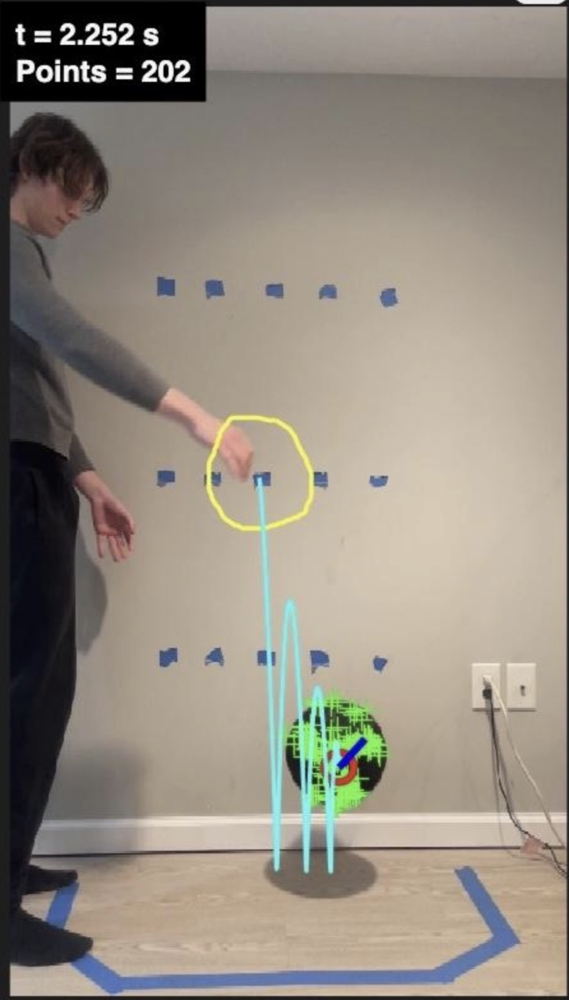
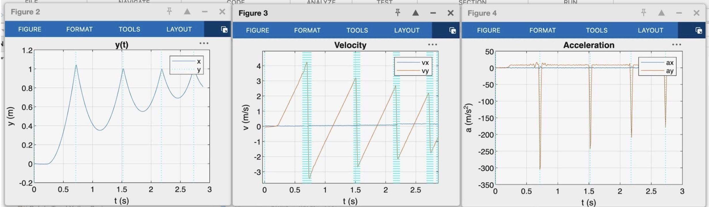

# MATLAB Rigid Body Motion Tracker

A MATLAB computer-vision system that tracks the translation and rotation of a rigid body from video.

I developed this tracker during undergraduate research at Rutgers University under Professor Haim Baruh. It began as a way to analyze impact experiments, specifically for rods and spheres, but I continued expanding it into a more general tool for tracking moving and rotating objects.

## What It Does

The tracker allows the user to:

- Calibrate video measurements using two points of known separation
- Draw a freehand region around the object being tracked
- Track feature points across successive video frames
- Measure the object's position and orientation over time
- Calculate linear velocity, acceleration, and jerk
- Calculate angular velocity and angular acceleration
- Detect potential collisions from changes in motion
- Optionally calculate energy and coefficient of restitution
- Reselect the tracked object while the program is running
- Export calculated data for further analysis

## Example Results
  

  

  Tracked feature points, orientation, and trajectory during a basketball impact experiment.

### Examples of Video Results

The plots below show the measured position, velocity, and acceleration
across multiple basketball impacts. The sharp acceleration changes
correspond to contact with the ground.

Keep in mind the software also tracks jerk, orientation, angular velocity/acceleration, kinetic/rotational energy, and can automatically detect collisions too. 

## Requirements

- MATLAB
- Image Processing Toolbox
- Computer Vision Toolbox

The required toolboxes can be installed through:

`Home → Add-Ons → Explore Add-Ons`

I originally developed the tracker using [MATLAB Online](https://matlab.mathworks.com/), although it also runs in the MATLAB desktop application.

## How to Run

1. Download `RigidBodyMotionTracker_Public.m`.
2. Place your video somewhere accessible to MATLAB.
3. Enter the video filename or full file path in the `VideoFile` variable near the top of the script.
4. Adjust `rotateAngle` if the video is displayed in the wrong orientation.
5. Click **Run**.
6. Select two points separated by a known physical distance.
7. Enter that distance in meters in the Command Window.
8. Draw a freehand region around the object you want to track.
9. The tracker will begin processing the video and generating the selected outputs.

## Important Settings

The top of the script contains settings for:

Video rotation
Slow-motion correction
Frame skipping
Smoothing
Collision detection
Plot selection
Energy analysis
Feature-point detection
Motion filtering

The default tracking settings have worked well across my test videos, so I would recommend changing them carefully.

## Program Controls

While tracking, the interface includes:

Stop Early — ends tracking and keeps the collected results
Reselect ROI — allows the object region to be redrawn
Terminate — exits the program without continuing the analysis
Research Application

The tracker was used to analyze rigid-body impact experiments from high-speed video. It supported the calculation of linear and angular kinematics, energy changes, and coefficient of restitution across repeated trials.

Raw research videos and complete experimental datasets are not included in this public repository.

## Version

Current public version: 6.2

Last updated: August 29, 2026
